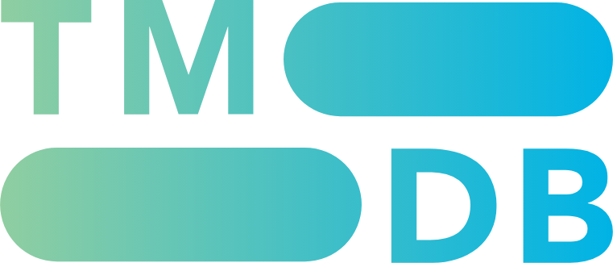

# DABOM


[](LICENSE)

지정한 보관 위치의 영화, 드라마, 애니메이션을 찾아 메타데이터와 포스터를 함께 관리하는 Windows 데스크톱 앱입니다.

DABOM은 흩어진 영상 파일을 하나의 라이브러리로 정리합니다. 영상은 Windows 기본 앱으로 재생하며, 원본 파일의 이름이나 내용은 변경하지 않습니다.

## 주요 기능

- 여러 보관 위치와 하위 폴더의 영상을 재귀적으로 탐색
- 제목, 원제, 감독, 배우, 파일명 검색
- 제목, 개봉일, 파일 수정일 기준 정렬
- 아직 보지 않은 영상을 우선하는 `다음에 볼 영상` 추천
- Windows 기본 앱 재생 및 마지막 재생 시각 기록
- 파일명 분석과 TMDB 검색을 통한 메타데이터·포스터 자동 보강
- 영화와 TV 에피소드의 메타데이터 온라인 검색 및 직접 편집
- 접근할 수 없는 파일과 폴더를 별도 경고로 표시
- 라이브러리와 포스터를 사용자 로컬 데이터에 저장

### 지원 영상 형식

`MP4` · `MKV` · `AVI` · `MOV` · `WMV` · `M4V` · `WebM` · `TS` · `M2TS`

## 시작하기

### 요구 사항

- Windows
- [.NET 9 SDK](https://dotnet.microsoft.com/download/dotnet/9.0)
- Git — 저장소 복제 시 필요
- TMDB API 읽기 액세스 토큰 — 메타데이터 자동 보강 및 온라인 검색 시 선택적으로 필요

### 빌드 및 실행

```powershell
git clone https://github.com/KindTis/DaBom.git
cd DaBom
dotnet build Dabom.sln
dotnet run --project src/Dabom/Dabom.csproj
```

### TMDB 설정

TMDB 연동을 사용하려면 `%LOCALAPPDATA%\Dabom\.env` 파일을 만들고 다음 내용을 저장합니다.

```dotenv
DABOM_TMDB_ACCESS_TOKEN=YOUR_TMDB_READ_ACCESS_TOKEN
```

토큰은 [TMDB](https://www.themoviedb.org/) 계정의 API 설정에서 발급받을 수 있습니다. 실제 토큰이 포함된 `.env` 파일은 저장소에 커밋하지 마세요.

TMDB 토큰이 없어도 로컬 영상 탐색, 검색, 정렬, 재생과 직접 편집 기능은 사용할 수 있습니다.

## 사용 방법

1. DABOM을 실행하고 `보관 위치 추가`에서 영상 폴더를 선택합니다.
2. 폴더 탐색이 끝나면 발견한 영상이 라이브러리에 표시됩니다.
3. TMDB 토큰이 설정되어 있으면 새 영상의 메타데이터와 포스터를 자동으로 찾습니다.
4. 검색창과 정렬 메뉴로 원하는 영상을 찾습니다.
5. 영상을 재생하거나 메타데이터 편집 창에서 정보와 포스터를 수정합니다.

## 프로젝트 구조

```text
Dabom/
├─ src/Dabom/
│  ├─ Library/          # 영상 탐색, 라이브러리 저장, 표시 규칙
│  ├─ Metadata/         # 파일명 분석, TMDB 연동, 메타데이터 편집
│  ├─ Main/             # 메인 화면 ViewModel과 영상 항목
│  └─ *.xaml            # WPF 화면과 테마
└─ tests/Dabom.Tests/   # MSTest 단위 및 마크업 테스트
```

## 개발 및 테스트

전체 테스트를 실행합니다.

```powershell
dotnet test Dabom.sln
```

프로젝트는 WPF와 C#으로 작성되며 `net9.0-windows`를 대상으로 합니다.

## 데이터 저장 위치

DABOM의 사용자 데이터는 `%LOCALAPPDATA%\Dabom`에 저장됩니다.

| 경로 | 내용 |
| --- | --- |
| `library.json` | 보관 위치, 영상 메타데이터, 재생 기록 |
| `posters\` | 내려받거나 직접 선택한 포스터 |
| `.env` | TMDB 읽기 액세스 토큰 |

보관 위치의 원본 영상 파일은 수정하거나 이동하지 않습니다.

## TMDB 고지



This product uses the TMDB API but is not endorsed or certified by TMDB.

## 라이선스

이 프로젝트는 [MIT License](LICENSE)로 배포됩니다.
